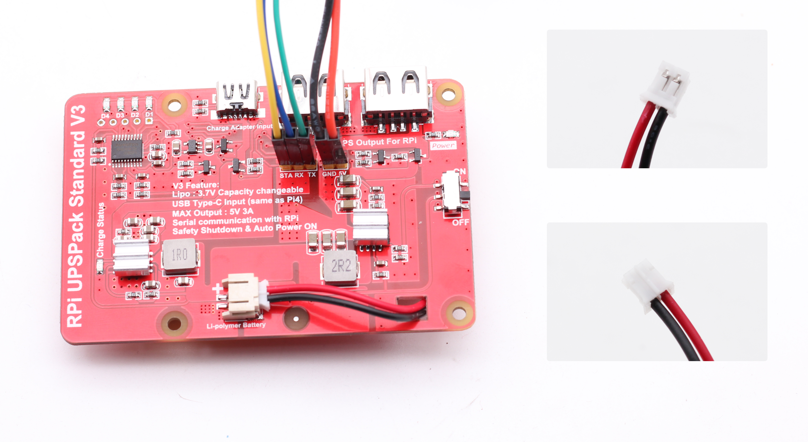
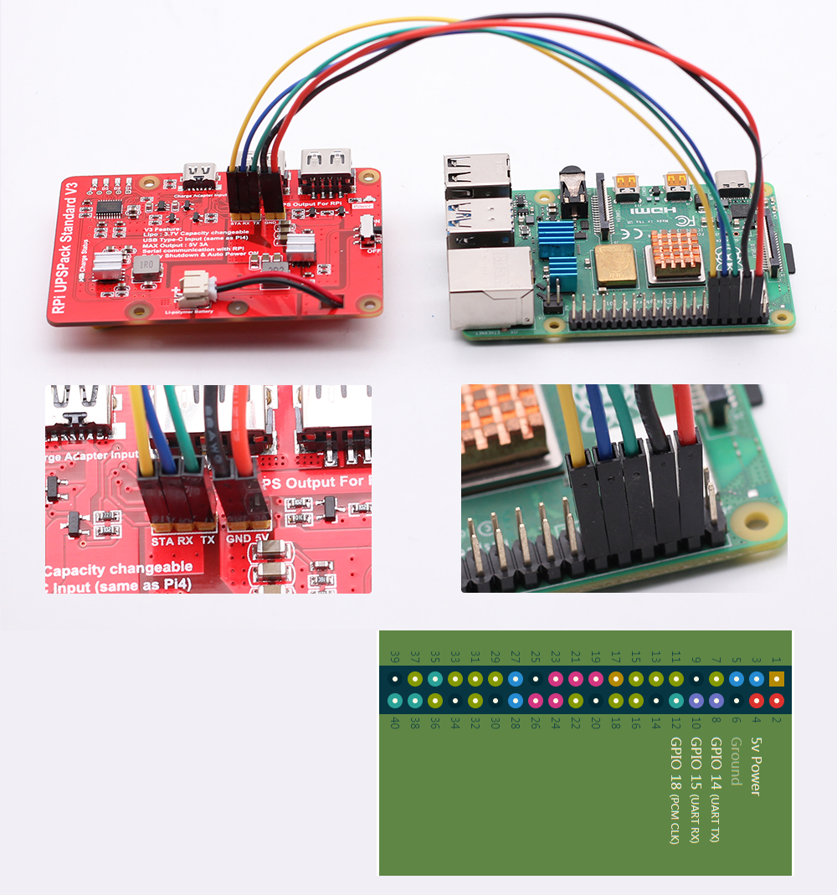

# RPi UPSPack V3 产品使用指南

UPSPack v3 是在2020年9月发布的新一代树莓派UPS不间断电源扩展板的最新型号。根据以往v1和v2版本的迭代升级，v3版本是目前树莓派UPS供电最稳定的一种供电方案。


## 目录

* [功能升级](#功能升级)
* [性能参数](#性能参数)
  * [输出电流](#输出电流)
  * 
* [硬件说明](#硬件说明)
  * [接口说明](#接口说明)
  * [供电方式](#树莓派供电方式)
  * [电池接口](#电池接口)


### 功能升级

以下列出UPS v3版本和v2版本的产品差异：

| 功能特点                                      | RPi UPSPack V3版本                           | RPi UPSPack V2版本                        |
| --------------------------------------------- | -------------------------------------------- | ---------------------------------------- |
| 输入接口                                      | TYPE-C接口（兼容最新Pi4的电源线）            | Micro-USB接口（兼容Pi3及更老型号的Pi）    |
| 最大输出电流                                  | 5V 3A                                        | 5V 3A                                     |
| 外部停电，Pi持续供电（不重启）                | 支持                                         | 支持                                      |
| 硬件开停机开关                                | 有                                           | 有                                        |
| GPIO供电接口和UART、halt signal信号接口       | 有                                           | 有                                        |
| 锂电池电量统计                                | 支持                                         | 支持                                      |
| 开机低压检测                                  | 支持                                         | 不支持                                    |
| 电源适配器异常检测（停电时刻检测）            | 支持                                         | 支持                                      |
| USB-A座输出电压值检测                         | 支持                                         | 支持                                      |
| 电池耗尽前自动通知关机                        | 支持                                         | 支持                                      |
| 停电后，程序自动开机                          | 支持（无需人工干预，程序开机）               | 不支持（需人工干预开机）                  |
| 停电后，UPS自动切换成休眠模式                 | 支持                                         | 不支持                                    |
|                                               |                                              |                                           |
| **UPS与Pi的串口（UART）通讯：**               |                                              |                                           |
| 通讯设置                                      | 9600 bps 8N1                                 | 9600 bps 8N1                              |
| 协议版本号                                    | V3.1（及更高版本）                           | V1.0                                      |
| 协议向下兼容性                                | 兼容V2老版本的UPS通讯协议                    | 兼容                                      |
|                                               |                                              |                                           |
| **UPS与Pi的单总线通讯（System halt signal）** |                                              |                                           |
| 通讯IO口                                      | UPS主板的STA接口连接树莓派GPIO18（BCM 18）   | UPS主板的STA接口连接树莓派GPIO18（BCM18） |
| 通讯协议                                      | 脉冲方式                                     | 电平方式                                  |
| 软件兼容性                                    | V3采用脉冲检测更为可靠（与V2版本软件不兼容） | 电平检测方式                              |


### 性能参数

以下是是UPS v3输出最大电流、续航时间、断电不重启、电池耗尽前安全关机和自动开机，几个方面来参数UPS v3的性能和注意事项。

#### 输出电流

通过EBC-A10H对UPS v3进行电流极限测试。输出最大电流能足量达到：5V 3A。经过实际测试Pi4运行官方Raspbian系统时，正常的功耗是5V 1A左右，如插入摄像头和U盘等外设的情况下，功耗逐渐增大到5V 2A。所以采用UPS v3对Pi4 进行供电，是有较大的余量的。并且在输出3A的情况下。2.54排针接口也能保证5V以上的供电。用户需要注意5V和GND必须使用硅胶杜邦线，如采用普通杜邦线，在电流较大时，会引起较大线损。从而在Pi4上屏幕上观察到闪电的低压符号。


#### 续航时间

UPS v3板载电池接口为PH 2.0封装（兼容以往的老型号UPS主板），PCB板上有印刷正极、负极的标志。产品提供了3种不同容量的电池可供客户选择。客户亦可自行接入不同容量、额定电压为3.7V的锂聚合物软包电池，或者是3.7V 18650/21700/21650电池组。注意：输入UPS电池接口的电压范围必须是小于等于4.2V。（所有电池组必须是并联关系，不能把电芯串联）。**不支持3.65v磷酸铁锂电池包**。UPS v3 标准成品提供3种容量、不同体积的锂电池供客户选择：

| 型号                                     | 体积（长 x 宽 x 厚） |
| ---------------------------------------- | -------------------- |
| 4000mAh（额定电压3.7V，电池内置保护板）  | 70mm x 41mm x 9.5mm  |
| 6500mAh（额定电压3.7V，电池内置保护板）  | 116mm x 50mm x 8mm   |
| 10000mAh（额定电压3.7V，电池内置保护板） | 115mm x 65mm x 9mm   |


我们搭建了不同的应用组合，得到了如下的续航数据：

| 电池容量 | Pi4单机 | Pi4+官方7寸屏 | Pi4+3.5寸（GPIO屏） | Pi4+5寸（HDMI屏） | Pi+7寸（HDMI屏） |
| -------- | ------- | ------------- | ------------------- | ----------------- | ---------------- |
| 4000mAh  | 5       | 待测          | 待测                | 待测              | 待测             |
| 6500mAh  | 9       | 待测          | 待测                | 待测              | 待测             |
| 10000mAh | 14      | 待测          | 待测                | 待测              | 待测             |

测试方式：

1. 以上所有数据单位为小时(hours)。为了更切近实际情况，不到60分钟的数据做省略处理，例如log记录值为344分钟，表格内只取5小时。
2. 运行的系统为：2020-05-27-raspios-buster-full-armhf ，系统不做任何设置修改。系统后台只运行一个RPi_runtime_recoder.py进行时间统计。
3. 3种容量的电池完全充满电量，然后接入树莓派后，利用程序进行时间记录。放电截至点为UPS让树莓派自动关机，通过log文件查看实际运行的时间。
4. 下载、并运行 UPSPACK_V3/time_count/RPi_runtime_recoder.py 进行时间记录。当树莓派关机后，接入其他电源适配器读取程序目录下的time_log.txt进行续航时间的查看。


#### 断电不重启


#### 安全关机和自动开机


### 硬件说明

#### 接口说明


| 标号 | 名称                       | 描述                                                         |
| ---- | -------------------------- | ------------------------------------------------------------ |
| 1    | TYPE-C 电源适配器充电接口  | 外部5V电源对UPS进行供电的接口，供电需求5V 2A-3A              |
| 2    | USB-A 座                   | 2个USB-A座对树莓派主板进行供电。                             |
| 3    | LED 电量指示灯             | 4个LED灯（D1-D4）用于指示锂电池的当前电量                    |
| 4    | UPS主板测试口              | 工厂用于烧录UPS程序和自动测试主板。该接口对用户无用。        |
| 5    | 新塘MCU控制器              | 用于充放电路径管理，和树莓派主板相互通讯等功能。             |
| 6    | 双PMU（Power Manger Unit） | 2颗锂电池充电和放电芯片（芯片带散热片，已加密）              |
| 7    | PH2.0 锂电池输入接口       | 支持1S 3.7V锂电池，可兼容3.7V18650 / 21700等电池组（要求电池组额定电压为3.7V） |
| 8    | UPS输出总开关              | ON / OFF 开关，当开关打到ON后，UPS输出5V到树莓派主板。OFF则反之。（外部停电且电池低压，程序会自动关闭输出电源） |
| 9    | 2.54mm排针口               | 3P排针口：分别为单线通讯和UART接口，用于连接树莓派主板的GPIO口，进行通讯。<br />2P电源口：通过树莓派GPIO电源接口进行5V供电。<br />产品默认赠送排针，玩家如需使用到以上接口，可以选择性焊接。 |
| 10   | 电源输出LED灯              | 当输出5V稳定后，LED绿灯亮起。                                |


#### 树莓派供电方式

UPS主板可以使用USB-A座对树莓派主板进行供电，也可以通过GPIO 5V接口对树莓派进行供电。两种供电方案，选任意一种即可。

| 供电方式                      | 说明                                                         |
| ----------------------------- | ------------------------------------------------------------ |
| 使用USB-A对树莓派主板进行供电 | UPS插入TYPE-C电源线与Pi4进行供电。（Pi3及更老版本可以使用Micro-USB线进行连接）。优点：无需焊接，使用方便。缺点：USB座和USB线组成的接口整体内阻稍大，适合Pi4常规应用。USB线请选择尽可能**短而粗**的线，减少线损压降，防止Pi4出现闪电符号的情况。如还是出现闪电符号，可选用如下的GPIO直接供电的方案进行供电。 |
| 通过GPIO接口对树莓派进行供电  | 在UPS上焊接5V排针，用22AWG短而粗的**硅胶杜邦线**对Pi4进行供电。用**柔软的硅胶杜邦线**可承受5A的电流，并且内阻较小。请勿使用普通铝包铜的信号杜邦线，这将会引入较大内阻，从而导致线损压降大，Pi屏幕上出现低压闪电符号。 |


|     供电方式（以下2选1）      |             **接线实例**              |
| :---------------------------: | :-----------------------------------: |
| 使用USB-A对树莓派主板进行供电 |  |
| 通过GPIO接口对树莓派进行供电  |    |


#### 电池接口

UPS主板的电池接口：**PH2.0座**。产品出厂配套的电池组内部已集成锂电池保护板。如用户想自行接入DIY的电池包，请注意以下几个注意事项：

* 电池输出线的接口为PH 2.0 公头，**注意接口的正极和负极！如电池线接反，UPS将会烧毁！**

* 自主电池组为1S 3.7V锂电池：标准额定电压3.7V，充满电压4.2V。常规兼容型号：18650、21700等锂电池。**不兼容磷酸铁锂电池。**

* 容量无特别要求，但考虑到Pi4续航，最佳容量最好大于4000mAh

* 自己组装的电池组尽量带6A及以上大电流锂电池保护板：市面上常规的锂电池保护板参数为3A-4A，当外部需要大电流时，电流太小的保护板可能会导致电池输出异常。



  

#### 通讯与电源接口

##### 输出接口

UPS V3 与树莓派通讯，采用2种方式：UART接口和STA单总线接口。STA单总线接口简单灵活，只需要在pi上通过任意一个闲置的GPIO口（提供的Pi端python程序默认为：GPIO 18，玩家可自行更改）和UPS就能进行通讯。UART接口则可以让PI读取更为丰富的UPS目前工作信息。

2个接口的作用如下：

* UART接口：UPS和树莓派的板载串口进行通讯。树莓派可以得到的信息：通讯心跳包、外部是否停电、电池容量百分比、向外输出电压值。
* STA单总线接口：UPS主板在电池耗尽之前发送给树莓派主板一个脉冲信息（Halt signal），让树莓派安全的进行软件关机。当树莓派安全关机后，再次切断树莓派的5V主供电电源。（USB-A座和2P排针座都受程序控制）。当外部电源恢复后，UPS主板会自动进入充电流程，当电池充电到达一定容量，会自动对树莓派恢复供电。




##### 输入接口

UPS v3主板通过 TPYE-C线 对 UPS主板进行供电。对外部电源适配器的需求是5V 2A - 5V 3A。UPS内部有电源路径管理系统，会自动调节输入电流的大小。例如：当外部无负载、或者负载较轻，且UPS板载的电池也已经充满的情况下。输入电流会约等于负载的消耗电流。TYPC-C 输入的充电线，尽量采用短而粗的电源线，让线损较小，从而到达UPS的主板的功率是充足的。

**提示：如果电源头标称参数为5V 3A，让UPS工作在边充边放状态，电池电量还一直在减少的主要原因，就是输入TYPE-C的线损较大（或电源头参数虚标），实际电源适配器到达UPS接口的功率不足以同时给负载供电和同时给电池充电导致的。 解决方案：更换大品牌质量可靠的电源头和品牌充电线（较粗）。**


### 安装驱动

1. 把产品配套的资料包，解压缩到 `/home/pi/UPSPACK_V3` 目录下。检查**shutdown_check.py**的完整目录是

    > **shutdown_check.py**完整目录为如下：
    >
    > /home/pi/UPSPACK_V3/shutdown_check.py

2.  更改`/etc/rc.local`，把自动关机的程序添加成开机自动启动

    > ```shell
    > sudo nano /etc/rc.local
    > 
    > #在最下面的 exit 的上面一行添加如下内容
    > 
    > sudo python3 /home/pi/UPSPACK_V3/shutdown_check.py &
    > ```

3. 完成以上步骤，即可实现当电池耗尽前，树莓派自动安全关机的功能。并且当外部恢复电源，UPS板子会自动进行充电。当电池充电到一定电量后，UPS会自动开启树莓派的电源。
